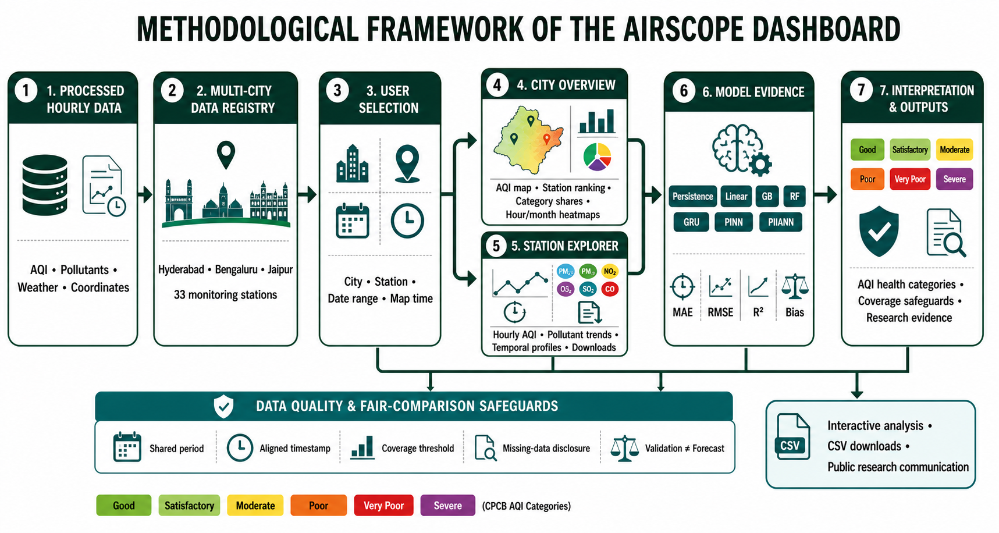
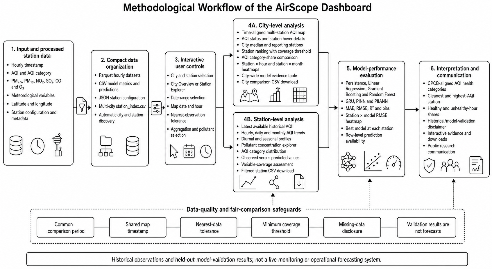

# PIIANN AQI Dashboard

PIIANN AQI Dashboard is an interactive, data-driven air-quality monitoring and model-analysis application built with Streamlit. It presents historical hourly air-quality observations, station-to-station comparisons, pollutant behaviour, data-quality information, and validation results from conventional and physics-informed machine-learning models.

The project is intended to make detailed air-quality analysis easier to explore for researchers, students, policymakers, environmental professionals, and members of the public. It complements the underlying scientific workflow by converting its processed results into an accessible web application.

> **Important:** The current deployment is a historical and model-validation dashboard. It is not a live CPCB sensor feed and must not be interpreted as a real-time warning system or medical service.

## Project objectives

The dashboard is being developed to:

- provide a unified view of hourly air quality across multiple Indian cities;
- compare monitoring stations using the same selected period and map timestamp;
- communicate AQI categories using CPCB-aligned colours and public-health guidance;
- explore PM2.5, PM10, NO₂, SO₂, CO, and O₃ behaviour;
- identify temporal patterns at hourly, daily, monthly, and seasonal scales;
- compare conventional, deep-learning, and physics-informed AQI models;
- report missing data and station coverage alongside every comparison;
- support reproducible analysis and the public communication of research results; and
- provide a scalable structure into which additional city result bundles can be imported.

## Cities and stations currently included

| City | Monitoring stations |
|---|---:|
| Delhi | 38 |
| Mumbai | 19 |
| Kolkata | 7 |
| Chennai | 9 |
| Hyderabad | 14 |
| Bengaluru | 13 |
| Jaipur | 6 |
| **Total** | **106** |

The city selector is deliberately ordered as Delhi, Mumbai, Kolkata, Chennai, Hyderabad, Bengaluru, and Jaipur. Additional cities are discovered from the dashboard's compact station registry after import.

## Application pages

- **City dashboard:** maps, rankings, temporal patterns, pollution burden, city-wide model evidence and reliability.
- **Station explorer:** detailed AQI, pollutant, model and data-quality tabs for an individual station.
- **Research visuals:** manuscript-style station–pollutant bubble tables, ranked dot plots, calendar/temporal heatmaps, seasonal distributions and correlation-dot matrices.
- **References:** searchable author–year bibliography with direct article/PDF links.
- **About & acknowledgement:** formal MCA project-submission details and acknowledgement.

The City Dashboard begins with the publication-quality national study-area figure and a separate interactive seven-city map. Hovering over a processed city displays its station count, latest historical median AQI, AQI category, station range, and most recent available record. The 250 km circles indicate nominal study domains rather than pollutant dispersion or administrative boundaries.

## Methodological framework diagrams

The following diagrams summarize the dashboard workflow from processed hourly data and the multi-city registry through user selection, city/station analysis, model evidence, interpretation, quality safeguards, and downloadable outputs.

> **Version note:** These diagrams were prepared for an earlier dashboard version and therefore retain the former “AirScope” heading and the earlier three-city/33-station registry. The current application is named **PIIANN AQI Dashboard** and contains **seven cities and 106 monitoring stations**. The overall methodological flow remains applicable.

### Colour version



### Black-and-white version

The black-and-white version is provided for thesis printing, monochrome reports, and manuscript submission requirements.



## Dashboard capabilities

### City overview

The city-level interface compares all monitoring stations in a selected city.

- Interactive AQI map with CPCB-category marker colours
- Hover details for station, AQI, category, dominant pollutant, and observation time
- Shared map date and hour for fair station comparison
- Adjustable nearest-observation tolerance
- City median AQI and reporting-station count
- Cleanest and highest-AQI station at the selected snapshot
- Rankings by mean AQI, median AQI, healthy-hour share, or unhealthy-hour share
- Minimum-coverage safeguard for station rankings
- Station-by-hour AQI heatmap
- Station-by-month AQI heatmap
- AQI-category exposure comparison
- Poor-or-worse and Good/Satisfactory hour percentages
- Station-level AQI data-coverage comparison
- Downloadable city-comparison table

### City model laboratory

The City Model Lab summarizes AQI validation performance across every station.

- Complete station-by-model evidence table
- Mean city-level MAE, RMSE, R², and bias
- Number of stations evaluated by each model
- Count of stations at which each model was best by RMSE
- Station × model RMSE heatmap
- Explicit indication of whether row-level predictions were saved
- Downloadable city-wide model evidence

Models represented in the result bundles include:

1. Persistence baseline
2. Linear Regression
3. Gradient Boosting
4. Random Forest
5. Gated Recurrent Unit (GRU)
6. Physics-Informed Neural Network (PINN)
7. Physics-Informed Integrated Artificial Neural Network (PIIANN)

All seven models have aggregate validation metrics where training completed. In the current result bundles, row-level observed-versus-predicted values are generally saved only for GRU, PINN, and PIIANN. Conventional model metrics are still included in the city and station comparisons.

### Station explorer

The station-level interface provides detailed investigation of one monitoring location.

- Date-range filtering
- Latest available historical AQI and category
- AQI health-information panel
- Hourly AQI trajectory
- Daily and monthly aggregation
- Diurnal profile by hour of day
- Seasonal profile by month
- AQI-category distribution
- Interactive pollutant comparison
- Monitoring-station map
- Model ranking by validation performance
- Observed-versus-predicted scatterplot where rows were saved
- Variable-level data coverage
- Filtered CSV download
- GRU, PINN, and PIIANN available in the point-level model-diagnostics selector
- Model-specific MAE, RMSE, R², bias, and validation-row cards
- Residual histogram and AQI-category confusion matrix where prediction rows were saved
- Manuscript-style descriptive table with confidence intervals, percentiles, skewness, and kurtosis
- Robust-scaled multi-variable box plots
- Hour × weekday and month × year heatmaps
- Seasonal density/violin view
- Exceedance-frequency and empirical cumulative-distribution curves
- Principal component analysis with seasonal score plot and component loadings
- Consecutive Poor+ pollution-episode table
- Robust anomaly screening and annotated anomaly time series

Point-level prediction diagnostics are displayed only for GRU, PINN, and PIIANN because the compact bundles contain observed and predicted rows for these models. Random Forest, Gradient Boosting, Linear Regression, and Persistence remain in the aggregate model-comparison chart but are temporarily excluded from the diagnostic selector.

## AQI categories

The dashboard uses the following AQI categories and visual colours:

| AQI | Category | Dashboard colour |
|---:|---|---|
| 0–50 | Good | Green |
| 51–100 | Satisfactory | Light green |
| 101–200 | Moderate | Yellow |
| 201–300 | Poor | Orange |
| 301–400 | Very Poor | Red |
| 401–500 | Severe | Purple |

Grey map markers indicate that no AQI observation was found within the selected timestamp tolerance. Health messages are informational and are not a substitute for guidance from public-health authorities or qualified medical professionals.

## Data and analytical design

Each station bundle can contain:

- a standardized hourly timeline;
- AQI and AQI category;
- PM2.5, PM10, NO₂, SO₂, CO, and O₃;
- additional pollutants where available;
- temperature, relative humidity, wind, rainfall, pressure, or solar variables where available;
- station latitude and longitude;
- AQI model-validation metrics;
- row-level AQI predictions for selected models;
- pollutant predictions; and
- a station configuration file describing features and model settings.

The web application uses compact Parquet files for hourly data and CSV/JSON files for metrics and metadata. All charts are generated dynamically. Pre-rendered PNG figures, duplicate hourly CSV files, training logs, original result ZIP files, and neural-network weights are intentionally excluded from the deployment bundle.

## Fair-comparison safeguards

Air-quality comparisons can be misleading when stations have different observation periods or missing-data rates. The PIIANN AQI Dashboard therefore applies the following safeguards:

- map values are matched to one shared date and hour;
- users choose an acceptable nearest-observation tolerance;
- stations without a nearby observation are shown in grey;
- rankings use a common selected period;
- a minimum AQI coverage threshold can exclude unreliable rankings;
- coverage is displayed alongside model and air-quality results; and
- model performance is kept separate from environmental cleanliness.

A station with the best prediction model is not necessarily the cleanest station. Similarly, a station with a low mean AQI should not be declared the cleanest without considering its observation coverage.

## Prediction interpretation and limitations

The underlying modeling workflow uses the preceding hourly history to evaluate next-hour AQI prediction. The current saved prediction tables represent held-out model-validation results; they are not continuously refreshed future forecasts.

The current research configuration includes a 24-hour history window and a one-hour prediction horizon. Some experiment outputs were produced using a random train/validation/test split. Operational future forecasting should instead use chronological or walk-forward validation, regularly updated observations, explicit forecast timestamps, and uncertainty estimates.

The dashboard therefore labels saved prediction results as **model validation**, not as a live forecast.

## Repository structure

```text
air-quality-piiml-dashboard/
├── streamlit_app.py             # Main Streamlit application
├── add_city.py                  # Compact city-bundle importer
├── assets/
│   └── Study-area.png           # Publication-quality India study-area figure
├── requirements.txt             # Python dependencies
├── README.md                    # Project documentation
├── .streamlit/
│   └── config.toml              # Streamlit theme and server configuration
└── data/
    ├── station_index.csv        # City and station registry
    ├── hyderabad/
    │   └── <station>/
    ├── bengaluru/
    │   └── <station>/
    ├── jaipur/
    ├── delhi/
    ├── mumbai/
    ├── chennai/
    ├── kolkata/
    │   └── <station>/
    └── city_summary/
```

Each compact station directory normally contains:

```text
station_hourly.parquet
station_config.json
model_metrics.csv
aqi_predictions.csv          # Optional
pollutant_predictions.csv    # Optional
```

## Installation

Python 3.12 or 3.13 is recommended. Python 3.14 may not have compatible prebuilt wheels for every pinned data dependency.

### Windows Command Prompt

```bat
py -3.13 -m venv .venv
.venv\Scripts\activate
python -m pip install --upgrade pip
python -m pip install -r requirements.txt
python -m streamlit run streamlit_app.py
```

### PowerShell

```powershell
py -3.13 -m venv .venv
.\.venv\Scripts\Activate.ps1
python -m pip install --upgrade pip
python -m pip install -r requirements.txt
python -m streamlit run streamlit_app.py
```

The application normally opens at:

```text
http://localhost:8501
```

Node.js and `npm install` are not required. This is a Python Streamlit application.

## Importing another city

The new city must first be processed by the modeling workflow so that it contains a valid `streamlit_bundle` and `station_index.csv`.

Run:

```bat
python add_city.py "C:\path\to\new_city_results"
```

The importer:

1. reads `streamlit_bundle/station_index.csv`;
2. validates required station files;
3. copies compact hourly data, configurations, metrics, and available predictions;
4. excludes figures, model weights, logs, and duplicate data; and
5. updates `data/station_index.csv` without duplicating existing city-station entries.

After importing a city, restart Streamlit or clear its data cache.

## Deploying on Streamlit Community Cloud

1. Create a public GitHub repository.
2. Upload the repository contents, but do not upload `.venv`, `__pycache__`, logs, result ZIP files, or original training folders.
3. Sign in at [Streamlit Community Cloud](https://share.streamlit.io/).
4. Select the GitHub repository and branch.
5. Set the entrypoint to `streamlit_app.py`.
6. Select a supported Python version, preferably Python 3.12 or 3.13.
7. Choose an available `*.streamlit.app` subdomain.
8. Deploy and set the application to public access.
9. Test the public URL in a private/incognito browser before sharing it.

## Reproducibility and responsible use

- Dashboard results depend on the supplied processed station bundles.
- Missing values remain missing and are not presented as observations.
- Station coverage varies by city, station, variable, and period.
- Model metrics should only be compared under compatible validation settings.
- Correlation does not establish a pollution source or causal relationship.
- The application should not be used for emergency response or individual medical decisions.
- A public dashboard URL should be accompanied by a versioned source-code/data archive for scholarly publication.

For manuscript publication, consider archiving a release through Zenodo and citing both the live Streamlit application and the archived DOI.

## Suggested citation

Replace the placeholders below after the manuscript, repository, and archival release are finalized:

```text
[Author(s)]. (Year). PIIANN AQI Dashboard
[Software]. Version X.Y.Z. GitHub: [repository URL].
Live application: [Streamlit application URL].
Archived version: [Zenodo DOI].
```

## Research acknowledgement

This dashboard is the presentation layer for a broader air-quality processing and physics-informed machine-learning workflow. The scientific manuscript should be consulted for complete information about data provenance, preprocessing, feature construction, model architecture, training, validation, uncertainty, and interpretation.

## Licence

No licence has yet been specified in this repository. Before public reuse or manuscript publication, add an appropriate software licence and confirm that redistribution of the processed air-quality data is permitted by the original data provider's terms.

## Contact

For research questions, collaboration, or reproducibility requests, add the corresponding author's name, institutional affiliation, and contact email here.
